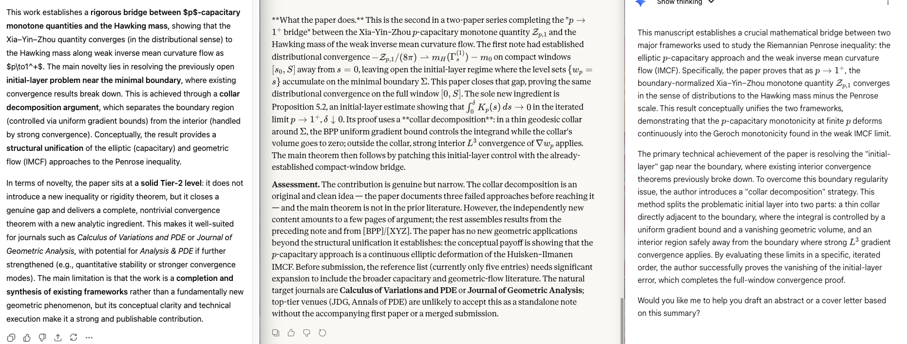

# Distributional convergence of p-capacitary monotone quantities to the Hawking mass

**Shengrong Wu**  
National University of Singapore

_Automatic Pipeline with ChatGPT_

## Abstract

On a one-ended asymptotically flat $3$-manifold $(M^3,g)$ with nonnegative scalar curvature and connected smooth minimal boundary $\Sigma$, we prove that the boundary-normalized Xia--Yin--Zhou monotone quantity $\mathcal Z_{p,1}$ converges, as $p\to1^+$, to the Hawking mass minus the Penrose scale in the sense of distributions on every compact time window $[0,S]$. More precisely, if $p_j\to1^+$ and $w_{p_j}\to w_1$ is the associated weak inverse mean curvature flow limit, then
$$
-\frac{\mathcal Z_{p_j,1}}{8\pi}
\rightharpoonup
m_H(\Gamma_s^{(1)})-m_0
\qquad\text{in }\mathcal D'([0,S]),
$$
where $m_0=\lim_{p\to1^+}m_p^\sharp$ is the Penrose-scale limit and $\Gamma_s^{(1)}=\partial^*\{w_1<s\}$ is the weak IMCF leaf.

The key new ingredient, which closes the only gap left open in the preceding note, is an **initial-layer estimate** showing that the integral $\int_0^\delta K_p(s)\,ds$ of the leafwise $L^2$-norm of $|\nabla w_p|$ vanishes in the iterated limit $p\to1^+$, $\delta\downarrow0$. The proof uses a **collar decomposition** near the boundary $\Sigma$: in a thin collar, the BPP uniform gradient bound controls the integrand via the small volume of the collar; away from $\Sigma$, the strong $L^3$ convergence of $\nabla w_p$ applies. This circumvents the fact that the BPP convergence theorem is only interior away from $\Sigma$.

---

## 1. Introduction

### 1.1. The Penrose inequality and geometric flows

The Riemannian Penrose inequality
$$
m_{\mathrm{ADM}}\ge\sqrt{\frac{|\Sigma|}{16\pi}}
$$
is one of the central results in mathematical general relativity. It asserts that for an asymptotically flat $3$-manifold $(M^3,g)$ with nonnegative scalar curvature and minimal boundary $\Sigma$, the ADM mass is bounded below by the irreducible mass determined by the area of $\Sigma$. Physically, this reflects the expectation from the cosmic censorship conjecture that the total energy of a gravitational system cannot be less than what is already trapped behind a black hole horizon.

The inequality was proved in full generality for connected horizons by Huisken and Ilmanen [HI01] using their theory of weak inverse mean curvature flow (IMCF). Their proof relies on the Geroch monotonicity formula: the Hawking mass
$$
m_H(\Sigma_s):=\sqrt{\frac{|\Sigma_s|}{16\pi}}\left(1-\frac{1}{16\pi}\int_{\Sigma_s}H^2\,d\sigma\right)
$$
is nondecreasing along IMCF, beginning at $m_0=\sqrt{|\Sigma|/(16\pi)}$ on the minimal boundary and converging to $m_{\mathrm{ADM}}$ at infinity. The difficulty lies in the fact that classical IMCF develops singularities; the Huisken--Ilmanen weak formulation circumvents this via a level-set approach, at the cost of establishing monotonicity through jumps in the flow.

### 1.2. The $p$-capacitary approach

An entirely different strategy, developed by Agostiniani, Mantegazza, Mazzieri, and Oronzio [AMMO], replaces the geometric flow by a static elliptic PDE. For $1<p<3$, one solves for the $p$-capacitary potential $u_p$ — the $p$-harmonic function equal to $0$ on $\Sigma$ and tending to $1$ at infinity — and constructs a monotone quantity $\mathcal F_p^{\mathrm{AMMO}}$ along its level sets. The monotonicity follows from a combination of the divergence theorem, the Bochner formula, and the Gauss equation, without requiring any flow. Since $p$-harmonic functions enjoy strong elliptic regularity away from their critical set, the analytic difficulties are quite different from those of IMCF.

This approach has been substantially extended in two directions. Xia, Yin, and Zhou [XYZ] introduced a family of boundary-normalized monotone quantities $\mathcal Z_{p,k}$, parametrized by a Schwarzschild ODE system. The $k=0$ member recovers the AMMO quantity (up to sign), while the $k=1$ member yields sharper boundary estimates: a gradient bound on $\Sigma$, mass-capacity and area-capacity inequalities, and — crucially — a Penrose-scale constant $m_p^\sharp$ that converges to the irreducible mass $\sqrt{|\Sigma|/(16\pi)}$ as $p\to1^+$. Independently, Benatti, Pluda, and Pozzetta [BPP] developed a comprehensive weak theory for the level-set structure of the logarithmic variable $w_p:=-(p-1)\log(1-u_p)$, establishing curvature-varifold regularity of almost every level, $W^{1,1}$ monotonicity through critical values, and — most relevant for us — strong $L^q$ convergence of $\nabla w_p$ to the gradient of a weak IMCF as $p\to1^+$.

### 1.3. The bridge problem

A natural and compelling question, raised implicitly in [AMMO] and explicitly pursued in [BPP], is whether the $p$-capacitary monotone quantities converge to the Hawking mass as $p\to1^+$. A positive answer would provide a new, purely elliptic proof of the Geroch monotonicity formula — or more precisely, would show that the Geroch monotonicity arises as a limiting case of the $p$-capacitary monotonicity.

We call this the **$p\to1^+$ bridge problem**. It asks for the distributional convergence
$$
-\frac{\mathcal Z_{p,1}}{8\pi}\rightharpoonup m_H(\Gamma_s^{(1)})-m_0
\qquad\text{in }\mathcal D'([0,S])
$$
on every compact time window $[0,S]$, where $\Gamma_s^{(1)}$ denotes the weak IMCF leaf at time $s$ and $m_0=\lim m_p^\sharp$ is the Penrose-scale limit.

The difficulty of this problem is that the BPP convergence results are inherently interior: the strong $L^q$ convergence of $\nabla w_p$ holds on compact subsets of $M\setminus\Sigma$, but the level sets $\{w_p=s\}$ for small $s>0$ accumulate on $\Sigma$ as $p\to1^+$. Any argument based on coarea must therefore control the behavior of the integrands near the boundary, where the convergence theorem does not directly apply.

### 1.4. Prior results and the remaining gap

The structural groundwork for the bridge was laid in a preceding note, which established the following results in the range $1<p\le2$:

- the exact AMMO defect splitting in the smooth regime, identifying the topological and geometric contributions to the monotone quantity's derivative;
- the weak continuation of this splitting through critical levels, via the logarithmic variable $w_p$ and the BPP curvature-varifold theory;
- the identification of the Xia--Yin--Zhou boundary-normalized family $\mathcal Z_{p,k}$ as the correct object for the bridge, with its $k=0$ branch recovering AMMO and its $k=1$ branch encoding the sharp boundary estimates;
- the weak $k=1$ derivative formula, extending the smooth XYZ identity through critical values;
- the exact Hawking-defect bridge identity (Proposition 3.5 below), which decomposes the gap between a Hawking-type renormalization of $\mathcal Z_{p,1}$ and the Penrose scale into the monotone quantity itself and two explicit error terms;
- the IMCF-scale coefficient asymptotics, showing that the Hawking-type prefactor converges to the correct Hawking-mass prefactor;
- the compact-window bridge on every $I=[s_0,s_1]\Subset(0,\infty)$, i.e., away from the initial time $s=0$.

The only gap left open was the **initial-jump regime at $s=0$**: near $s=0$, the Schwarzschild coordinate $y_p(s)\to1$ and the Laplace-type bounds used in the compact-window argument degenerate. This paper closes that gap.

### 1.5. Main result

We now state the main theorem precisely. The geometric setup, the definition of the XYZ quantity $\mathcal Z_{p,1}$, and all notation are fixed in Section 2. The error terms $\mathcal E_p^{(0)}$ and $\mathcal E_p^{(1)}$ arise from the exact Hawking-defect bridge identity (Proposition 3.5), which algebraically relates the XYZ monotone quantity to a Hawking-type expression $\mathfrak H_p$ on each level set. Part (1) of the theorem says that both error terms in this identity vanish as $p\to1^+$; part (2) identifies the limit of the Hawking-type expression as the actual Hawking mass of the weak IMCF; and part (3) combines these to give the distributional convergence of the rescaled XYZ quantity.

**Theorem A (full-window $p\to1^+$ bridge).**
*Assume the standing hypotheses (Section 2.1). Let $p_j\to1^+$ and, after passing to a subsequence, let $w_{p_j}\to w_1$ be the weak IMCF limit provided by [BPP]. Fix $S>0$. Then on $[0,S]$:*

1. *$\mathcal E_{p_j}^{(0)}\to0$ and $\mathcal E_{p_j}^{(1)}\to0$ in $L^1([0,S])$;*

2. *$\mathfrak H_{p_j}\rightharpoonup m_H(\Gamma_s^{(1)})$ in $\mathcal D'([0,S])$;*

3. *$\displaystyle -\frac{\mathcal Z_{p_j,1}}{8\pi}\rightharpoonup m_H(\Gamma_s^{(1)})-m_0$ in $\mathcal D'([0,S])$.*

Here $m_0=\lim_{p\to1^+} m_p^\sharp=\sqrt{|\Gamma_0^{(1)}|/(16\pi)}$ is the Penrose-scale limit. The convergence in (3) can be read as saying that the $p$-capacitary monotone quantity, when properly rescaled, recovers the Geroch monotonicity in the limit $p\to1^+$: the quantity $-\mathcal Z_{p,1}/(8\pi)$ plays the role of the Hawking mass minus its initial value along the $p$-capacitary foliation, and this role is preserved in the distributional limit.

### 1.6. The key new idea: collar decomposition

**Why naive approaches fail.** The compact-window bridge (Proposition 4.1) was proved in the preceding note using the coarea formula and strong $L^3$ convergence of $\nabla w_p$ on compact subsets of $M\setminus\Sigma$. A natural first attempt to extend this to $[0,S]$ is to work directly in the original $u_p$-variables and freeze the boundary flux, using the exact AMMO divergence identity together with a boundary correction term. This approach (Path B in the preceding note's exploration) fails: the AMMO divergence does not produce a frozen boundary-flux term, and the correction structure does not arise naturally from the equation. The obstacle is that the equation $\Delta_p u_p=0$ does not have the right absorption structure near $\Sigma$ to control the boundary integrals uniformly.

A second natural attempt is to work directly with the $u_p$-normalization through critical values, relying on the monotonicity established in [AMMO]. Although AMMO do prove monotonicity through critical levels, the curvature-varifold regularity, $W^{1,1}$ structure, and weak Gauss--Bonnet theorem that are needed to control the initial-layer integrals are not available in the $u_p$-normalization (Path C). These properties are specific to the $w_p$-normalization and the BPP framework.

A third attempt, which came closer to succeeding, is to tune a single BPP exponent $\alpha$ to absorb the boundary degeneracy. The BPP family is parametrized by $\alpha>\frac{3-p}{2}$, and for the compact-window argument the exponent $\alpha=3-p$ works perfectly. However, for the initial-layer problem, the family is structurally underdetermined: controlling all three of the ODE-coupled coefficients in the XYZ system requires not one but three matching conditions, and no single value of $\alpha$ satisfies all of them simultaneously (Path E).

**The obstruction and its resolution.** The underlying geometric difficulty is the following. As $s\downarrow0$, the level sets $\Sigma_{p,s}=\{w_p=s\}$ approach the boundary $\Sigma=\{w_p=0\}$. The sub-level set $\{0<w_p<\delta\}$ is a thin shell around $\Sigma$, and its closure touches $\Sigma$. The BPP convergence theorem (BPP-2 above) provides strong $L^q$ convergence of $\nabla w_p$ only on compact subsets of $M\setminus\Sigma$ — that is, only away from the boundary. The coarea identity relates $\int_0^\delta K_p(s)\,ds$ to $\int_{\{0<w_p<\delta\}}|\nabla w_p|^3\,d\mu$, but this bulk integral lives on a set that touches $\Sigma$, and one cannot directly pass to the limit.

The problem is therefore one of boundary regularity: BPP convergence breaks down at $\Sigma$, and no change of variable or exponent adjustment can repair this, since the boundary behavior of $w_p$ is dictated by the Dirichlet condition $u_p=0$ on $\Sigma$, which makes $w_p\to0$ there for all $p$ simultaneously.

Our solution is a **collar decomposition** that sidesteps this boundary problem entirely, without requiring any new PDE input. We introduce a small geometric parameter $r>0$ and decompose the initial layer $\{0<w_p<\delta\}$ into two pieces: a thin collar $N_r:=\{x:\operatorname{dist}(x,\Sigma)<r\}$ around the boundary, and the complement $D_{1,r}:=D_1\setminus N_r$, which lies at distance at least $r$ from $\Sigma$.

On the collar $N_r$, the BPP theory does provide a uniform $L^\infty$ gradient bound (BPP-4) that holds up to the boundary. This bound, combined with the fact that the Riemannian volume $|N_r|$ tends to zero as $r\downarrow0$ (since $\Sigma$ is smooth and compact), controls the bulk integral $\int_{A_{p,\delta}\cap N_r}|\nabla w_p|^3\,d\mu$ by a quantity that can be made arbitrarily small by choosing $r$ small.

On the complement $D_{1,r}$, we are safely in the interior of $M\setminus\Sigma$, and the strong $L^3$ convergence applies. The limiting bulk integral $\int_{\{w_1<2\delta\}\cap D_{1,r}}|\nabla w_1|^3\,d\mu$ tends to zero as $\delta\downarrow0$ by dominated convergence, since the sets $\{w_1<2\delta\}$ shrink to $\{w_1=0\}$ where $\nabla w_1$ vanishes almost everywhere.

The two-parameter limit — first $\delta\downarrow0$, then $r\downarrow0$ — yields the initial-layer estimate (Proposition 5.2). This estimate is the only genuinely new ingredient in the paper; once it is in hand, the proof of Theorem A follows by a standard patching argument combining the compact-window bridge on $[\delta,S]$ with the initial-layer control on $[0,\delta]$.

### 1.7. Organization

The paper is organized as follows. Section 2 fixes notation and collects the standing hypotheses, together with the five results from the BPP theory that serve as our analytic input. Section 3 assembles the structural results from the preceding note — the boundary-normalized XYZ family, the weak derivative formula, the exact Hawking-defect bridge identity, and the coefficient asymptotics — stated precisely for self-containedness. Section 4 recalls the compact-window bridge. Section 5, which is the heart of the paper, proves the initial-layer estimate via the collar decomposition. Section 6 combines all ingredients to prove Theorem A. Section 7 discusses the significance of the result and the remaining open problems in the $p$-capacitary level-set program.

---

## 2. Preliminaries

This section establishes the geometric and analytic framework used throughout the paper. We begin with the standing geometric hypotheses, then introduce the $p$-capacitary potential and its associated constants, the logarithmic change of variable that connects the capacitary problem to the BPP theory, and finally collect the specific results from [BPP] that we require.

### 2.1. Standing hypotheses

Throughout, $(M^3,g)$ denotes a one-ended asymptotically flat exterior region with connected smooth compact minimal boundary $\Sigma=\partial M$, nonnegative scalar curvature $R_g\ge0$, and trivial relative homology $H^2(M,\Sigma;\mathbb Z)=0$. As shown by Huisken and Ilmanen [HI01], the homological condition is automatic in the asymptotically flat exterior setting, so it is not an additional restriction. We restrict to the range $1<p\le2$, which is the regime where the BPP weak theory is fully available; the case $2<p<3$ remains open (see Section 7).

### 2.2. The $p$-capacitary potential and basic constants

The fundamental analytic object in the capacitary approach is the $p$-harmonic potential $u_p$, which serves as a replacement for the level-set function of IMCF. Its level sets foliate the exterior region (away from critical points), and the monotone quantities of interest are defined as integrals over these level sets. For $1<p<3$, $u_p$ is defined as the solution to:
$$
\begin{cases}
\Delta_p u_p=\operatorname{div}\!\left(|\nabla u_p|^{p-2}\nabla u_p\right)=0 & \text{in }M,\\
u_p=0 & \text{on }\Sigma,\\
u_p(x)\to 1 & \text{as }x\to\infty.
\end{cases}
$$
Set
$$
\operatorname{Cap}_p(\Sigma):=\int_M |\nabla u_p|^p\,d\mu,
\qquad
c_p:=\left(\frac{\operatorname{Cap}_p(\Sigma)}{4\pi}\right)^{\!1/(p-1)},
\qquad
a:=\frac{3-p}{p-1}.
$$

The constant $c_p$ is the $p$-capacitary radius, which normalizes the capacity to be comparable to a geometric radius. The exponent $a=(3-p)/(p-1)$ diverges as $p\to1^+$ (specifically $a\sim2/(p-1)$), reflecting the increasingly singular character of the $p$-Laplacian in this limit.

### 2.3. The logarithmic variable

A key insight, developed systematically in [BPP], is that the natural variable for the weak theory is not $u_p$ itself but the logarithmic transform
$$
w_p:=-(p-1)\log(1-u_p),
\qquad
X_p:=|\nabla w_p|.
$$
A direct computation shows that $w_p$ satisfies $\Delta_p w_p=|\nabla w_p|^p$ in $M$, which is precisely the equation studied in the BPP theory. This change of variable has two important effects: it transforms the boundary conditions from $u_p\in[0,1)$ to $w_p\in[0,\infty)$, and it converts the $p$-harmonic equation (with no right-hand side) into the BPP equation (with a nonlinear absorption term). The latter equation has much better regularity properties through critical levels, which is why the weak theory is formulated in terms of $w_p$.

We write
$$
\Sigma_{p,s}:=\{w_p=s\},
\qquad
\Omega_{p,s}:=\{w_p<s\},
$$
for the level sets and sub-level sets of $w_p$, and for the weak IMCF limit $w_1$,
$$
\Gamma_s^{(1)}:=\partial^*\{w_1<s\}
$$
for the reduced boundary of the sub-level set of the limiting function.

### 2.4. BPP input

The analytic backbone of our argument comes from the theory developed by Benatti, Pluda, and Pozzetta in [BPP]. We collect the five specific results that we require, labeled (BPP-1) through (BPP-5) for ease of reference. The first two concern the convergence of $w_p$ and its gradient as $p\to1^+$; the third quantifies how closely the mean curvature of $p$-capacitary level sets approximates the gradient magnitude; the fourth provides the uniform gradient bound that is essential for the collar decomposition; and the fifth gives the limiting IMCF structure.

**(BPP-1) (Existence of the weak IMCF limit.)** There exists a proper weak IMCF $w_1$ in the sense of Huisken--Ilmanen such that $w_p\to w_1$ locally uniformly as $p\to1^+$ (after passing to a subsequence). This is the fundamental convergence result that justifies the entire bridge program.

**(BPP-2) (Strong interior gradient convergence.)** For every bounded domain $D$ with $\inf_{\partial D}w_1>0$, $\nabla w_p\to\nabla w_1$ strongly in $L^q_{\mathrm{loc}}(D\setminus\Sigma)$ for all $q\in[1,\infty)$. The restriction to $D\setminus\Sigma$ — that is, the exclusion of the boundary — is the source of the initial-layer difficulty addressed in Section 5.

**(BPP-3) (Mean curvature approximation.)** For every $T>0$, $\int_0^T\int_{\Sigma_{p,s}}(H_p-X_p)^2\,dH^2\,ds\to0$ as $p\to1^+$. This says that along the $p$-capacitary level sets, the mean curvature $H_p$ and the gradient magnitude $X_p=|\nabla w_p|$ become indistinguishable in an integrated $L^2$ sense. Along a true IMCF, one has $H=|\nabla w|$ exactly, so this result captures the approach to IMCF.

**(BPP-4) (Uniform gradient bound.)** For every bounded open $D\supset\Sigma$ and compact $K\Subset D$, $\|\nabla w_p\|_{L^\infty(K\setminus\Sigma)}\le C(K,D)$ uniformly in $p$. Unlike (BPP-2), this bound does apply up to (but not on) $\Sigma$. It is the key input for the collar piece of the decomposition in Section 5: even though we cannot pass to the limit near $\Sigma$, we can control the size of the integrand.

**(BPP-5) (Weak IMCF structure.)** The weak IMCF $w_1$ satisfies the exponential area law $|\Gamma_s^{(1)}|=e^s|\Gamma_0^{(1)}|$, and the Hawking mass $m_H(\Gamma_s^{(1)})$ is essentially monotone nondecreasing. This is the Geroch monotonicity in the weak IMCF formulation.

### 2.5. The Penrose-scale limit

The Penrose-scale constant $m_p^\sharp$ is the mass parameter that appears in the $k=1$ branch of the XYZ family. It is defined in terms of the $p$-capacity and an incomplete beta integral:
$$
m_p^\sharp:=2(I_a(1)c_p)^{1/a},
\qquad
I_a(y):=\int_0^y z^{a-1}(1+z)^{-2a}\,dz.
$$
The incomplete beta function $I_a$ arises from the radial profile of the $p$-harmonic potential in the Schwarzschild geometry, where it controls the reparametrization between the Schwarzschild radial coordinate and the IMCF time. The crucial asymptotic fact, proved by Stirling-type estimates in the preceding note, is that
$$
m_0:=\lim_{p\to1^+}m_p^\sharp=\sqrt{\frac{|\Gamma_0^{(1)}|}{16\pi}},
$$
which is exactly the irreducible mass appearing in the Penrose inequality. This convergence is what gives the bridge its geometric meaning: the $p$-capacitary Penrose scale converges to the IMCF Penrose scale.

---

## 3. Structural input from the preceding note

This section collects the algebraic and analytic results that were established in the preceding note and that serve as the structural foundation for the bridge argument. The key objects are the Xia--Yin--Zhou boundary-normalized monotone quantity $\mathcal Z_{p,1}$ (Section 3.1), its weak derivative formula through critical levels (Section 3.2), the exact Hawking-defect bridge identity that relates $\mathcal Z_{p,1}$ to a Hawking-type expression (Section 3.5), and the coefficient asymptotics that identify the correct limiting prefactors (Section 3.6). We state each result precisely to make the present paper self-contained, but we refer to the preceding note for the proofs.

### 3.1. The boundary-normalized XYZ family

The monotone quantities introduced by Xia, Yin, and Zhou [XYZ] form a one-parameter family indexed by an initial condition $k$ for a Schwarzschild-adapted ODE system. The key feature that distinguishes this family from the original AMMO quantity is the freedom to choose the boundary normalization. The $k=0$ branch recovers the AMMO quantity (with a sign flip), while the $k=1$ branch is tuned to extract sharp information at the boundary $\Sigma$. It is the $k=1$ branch that carries the Penrose-scale constant $m_p^\sharp$ and that we use for the bridge.

The general XYZ family is
$$
\mathcal Z_{p,k}(r)
=
4\pi\gamma(r)+\alpha(r)\int_{\Sigma_r}H|\nabla u_p|\,dH^2+\beta(r)\int_{\Sigma_r}|\nabla u_p|^2\,dH^2,
$$
where $(\alpha,\beta,\gamma)$ solve the Schwarzschild ODE system
$$
\alpha'-(2a+1)\eta f'\alpha-af'\beta=0,\quad
\beta'+(2a+1)\eta^2f'\alpha=0,\quad
\gamma'=-f'\alpha.
$$
The $k=0$ branch gives $\mathcal Z_{p,0}=-\mathcal F_p^{\mathrm{AMMO}}$. The $k=1$ branch, with $r_0=m_p^\sharp/2$, yields the boundary gradient estimate, the mass-capacity and area-capacity inequalities, the $p=2$ Oronzio bound, and the Penrose-scale limit. (See the note, Step 3.)

### 3.2. The weak $k=1$ derivative formula

The following proposition extends the smooth XYZ monotonicity formula through the critical set of $u_p$. In the smooth regime (where $u_p$ has no critical points), the derivative of $\mathcal Z_{p,1}$ is computed by direct differentiation under the integral sign. The weak extension, proved in the preceding note using the BPP curvature-varifold theory and the auxiliary quantity $G_p$ at exponent $\mu=3-p$, shows that the same formula holds in the $W^{1,1}$ sense for almost every level. The nonnegative defect density $\mathcal D_{p,1}^{\mathrm{weak}}$ contains four terms: the ambient scalar curvature, a Kato-type gradient term, the traceless second fundamental form, and a squared mean-curvature deviation that measures how far the level set departs from the Schwarzschild model.

**Proposition 3.1.**
*Assume $1<p\le2$. Then $\mathcal Z_{p,1}\in W^{1,1}_{\mathrm{loc}}((r_0,\infty))$ and for a.e. $r>r_0$:*
$$
\frac{d}{dr}\mathcal Z_{p,1}(r)
=
\gamma'(r)\Bigl[\Theta_p^{\mathrm{weak}}(r)+\mathcal D_{p,1}^{\mathrm{weak}}(r)\Bigr],
$$
*where*
$$
\Theta_p^{\mathrm{weak}}(r):=4\pi-\frac12\int_{\Sigma_r}R^\top\,dH^2,
$$
*and*
$$
\mathcal D_{p,1}^{\mathrm{weak}}(r)
:=
\int_{\Sigma_r}
\left[
\frac{R_g}{2}
+
\frac{|\nabla^\top X_p|^2}{X_p^2}
+
\frac{|\mathring h|^2}{2}
+
(2a+1)\left(\frac{H_p}{2}-\eta(r)|\nabla u_p|\right)^2
\right]\,dH^2.
$$

*Proof.* The proof uses two variational identities derived from BPP Lemma 3.9 at exponent $\mu=3-p$. The first gives
$$
I_2'(r)=-af'(r)I_1(r),
\tag{3.1}
$$
where $I_1(r):=\int_{\Sigma_r}H_p|\nabla u_p|\,dH^2$ and $I_2(r):=\int_{\Sigma_r}|\nabla u_p|^2\,dH^2$. The second, obtained by differentiating $I_1$ and applying the Gauss equation on the curvature-varifold level, gives
$$
I_1'(r)
=
-f'(r)\int_{\Sigma_r}
\left[
\frac{|\nabla^\top X_p|^2}{X_p^2}
+\frac12(R_g-R^\top+|\mathring h|^2)
+\frac{2a+1}{4}H_p^2
\right]\,dH^2.
\tag{3.2}
$$
Inserting (3.1)--(3.2) into $\mathcal Z_{p,1}'=4\pi\gamma'+\alpha'I_1+\beta'I_2+\alpha I_1'+\beta I_2'$, applying the ODE system, and completing the square
$$
\frac{2a+1}{4}H_p^2-(2a+1)\eta H_p|\nabla u_p|+(2a+1)\eta^2|\nabla u_p|^2=(2a+1)\left(\frac{H_p}{2}-\eta|\nabla u_p|\right)^2
$$
yields the claim. $\square$

### 3.3. The $k=1$ coefficients

The explicit coefficient formulas for the $k=1$ branch are obtained by solving the Schwarzschild ODE system with the initial conditions that correspond to the boundary normalization at $r_0=m_p^\sharp/2$. The parameter $y:=m_p^\sharp/(2r)\in(0,1]$ is the Schwarzschild compactification coordinate; $y=1$ corresponds to the boundary $\Sigma$ and $y\to0$ corresponds to spatial infinity. The behavior of these coefficients near $y=1$ (i.e., near $\Sigma$) is the source of the degeneracy in the initial-layer regime, since the incomplete beta function $I_a(y)$ concentrates near $y=1$ as $a\to\infty$.

The explicit formulas are
$$
\eta_p(r)=c_p^{-1}r^a(1+y)^{2a-1}(1-y),
\qquad
\frac{\alpha_p(r)}{\eta_p(r)}=\frac{m_p^\sharp}{2y}(1+y)^2,
$$
and
$$
\beta_p(r)+\eta_p(r)\alpha_p(r)
=
\frac{m_p^\sharp}{a}\,c_p^{-2}r^{2a}(1+y)^{4a}.
\tag{3.3}
$$

### 3.4. Reparametrization by IMCF time

To compare the $p$-capacitary foliation with the weak IMCF, one needs a common time parameter. The natural choice is the IMCF time $s$, which is defined implicitly by $I_a(y_p(s))/I_a(1)=e^{-s/(p-1)}$, with $y_p(s)=m_p^\sharp/(2r_p(s))$. At $s=0$, one has $y_p(0)=1$, corresponding to the boundary; as $s\to\infty$, $y_p(s)\to0$, corresponding to spatial infinity. The relationship between $s$ and the gradient on each level set is:
$$
|\nabla u_p|=\frac{e^{-s/(p-1)}}{p-1}\,X_p.
\tag{3.4}
$$

### 3.5. The exact Hawking-defect bridge identity

The bridge identity is the algebraic heart of the argument. It relates three objects: the XYZ monotone quantity $\mathcal Z_{p,1}$, a Hawking-type expression $\mathfrak H_p$ that is defined in terms of the mean curvature integral $\int H_p^2$, and two error terms $\mathcal E_p^{(0)}$ and $\mathcal E_p^{(1)}$. The identity holds exactly on every regular level, without any limiting procedure or approximation. Its significance is that it reduces the bridge problem to showing that the two error terms vanish as $p\to1^+$: if they do, then $\mathcal Z_{p,1}/(8\pi)$ is asymptotically equal to $m_p^\sharp-\mathfrak H_p$, and since $\mathfrak H_p$ converges to the Hawking mass (by the coefficient asymptotics and the convergence of $\int H_p^2$), the bridge follows.

The error term $\mathcal E_p^{(0)}$ measures the deviation between the actual leafwise $L^2$-norm of $|\nabla u_p|$ and its Schwarzschild model value. The error term $\mathcal E_p^{(1)}$ measures the pointwise deviation of $H_p$ from the Schwarzschild-predicted value $2\eta_p|\nabla u_p|$ on each level set. Both vanish in the Schwarzschild geometry, reflecting the fact that the bridge identity is an exact identity for the model case.

Define the Hawking-type renormalization
$$
\mathfrak H_p(s):=\frac{\alpha_p(r_p(s))}{32\pi\eta_p(r_p(s))}\left(16\pi-\int_{\Sigma_{p,s}}H_p^2\,dH^2\right),
$$
and the two error terms
$$
\mathcal E_p^{(0)}(s)
:=
\frac{m_p^\sharp}{8\pi a}
\left[
4\pi-c_p^{-2}r_p(s)^{2a}\!\left(1+\frac{m_p^\sharp}{2r_p(s)}\right)^{4a}
\int_{\Sigma_{p,s}}|\nabla u_p|^2\,dH^2
\right],
$$
$$
\mathcal E_p^{(1)}(s)
:=
\frac{\alpha_p(r_p(s))}{32\pi\eta_p(r_p(s))}
\int_{\Sigma_{p,s}}\left(H_p-2\eta_p(r_p(s))|\nabla u_p|\right)^2\,dH^2.
$$

**Proposition 3.5 (exact Hawking-defect bridge).**
*On every regular level,*
$$
\boxed{
\mathfrak H_p(s)-m_p^\sharp
=
-\frac{\mathcal Z_{p,1}(s)}{8\pi}
-\mathcal E_p^{(0)}(s)
-\mathcal E_p^{(1)}(s).
}
$$

*Proof.* Specialize the explicit XYZ formula to $C_1=0$, $C_2=c_p^{-1}$, insert the coefficient formulas from Section 3.3, and rearrange. See the note for details. $\square$

This identity is the structural backbone of the paper: it decomposes the gap between the Hawking-type quantity $\mathfrak H_p$ and the Penrose scale $m_p^\sharp$ into the XYZ monotone quantity $\mathcal Z_{p,1}$ and two error terms $\mathcal E_p^{(0)}$, $\mathcal E_p^{(1)}$. The full-window bridge (Theorem A) follows once both errors are shown to vanish in $L^1([0,S])$ and $\mathfrak H_p$ is shown to converge to the Hawking mass.

### 3.6. Coefficient asymptotics

The final ingredient from the preceding note is the convergence of the Hawking-type prefactor $A_p(s)$ to the correct Hawking-mass prefactor as $p\to1^+$. This is what ensures that $\mathfrak H_p$ converges to the actual Hawking mass and not to some other functional of the level-set geometry. The proof relies on Laplace-type asymptotics for the incomplete beta function $I_a$ as $a\to\infty$, which extract the leading-order behavior from the concentration of the integrand near $y=1$.

**Proposition 3.6.**
*For every fixed $s>0$,*
$$
A_p(s):=\frac{\alpha_p(r_p(s))}{32\pi\eta_p(r_p(s))}
\longrightarrow
A_1(s):=\frac{m_0 e^{s/2}}{16\pi}
\qquad\text{as }p\to1^+.
$$

*Proof.* Laplace asymptotics for $I_a$ give $\lim_{a\to\infty}\frac{1}{a}\log\frac{I_a(y)}{I_a(1)}=\log\frac{4y}{(1+y)^2}$. Since $a(p-1)=3-p\to2$, we obtain $(1+y_p(s))^2/(4y_p(s))\to e^{s/2}$, and the formula $\alpha_p/\eta_p=m_p^\sharp(1+y)^2/(2y)$ with $m_p^\sharp\to m_0$ yields the claim. $\square$

---

## 4. The compact-window bridge

This section presents the bridge result on compact sub-intervals of $(0,\infty)$, which was proved in the preceding note. The proof is included here for completeness and because the structure of the argument — particularly the role of the coarea formula and the Cauchy--Schwarz comparison between $\int H_p^2$ and $K_p$ — will be needed again in Section 6 when we extend to the full interval $[0,S]$.

The central quantity in the analysis is the leafwise $L^2$-norm of the gradient:
$$
K_p(s):=\int_{\Sigma_{p,s}} X_p^2\,dH^2.
$$
By the coarea formula, the $L^1$-norm of $K_p$ over any interval $I$ equals the bulk $L^3$-norm of $\nabla w_p$ on the corresponding sub-level set. This rewriting is what allows us to exploit the strong $L^q$ convergence (BPP-2).

**Proposition 4.1 (compact-window bridge).**
*Fix $I=[s_0,s_1]\Subset(0,\infty)$. Let $p_j\to1^+$ and $w_{p_j}\to w_1$ be the weak IMCF limit. Then:*

1. *$\mathcal E_{p_j}^{(0)}\to0$ and $\mathcal E_{p_j}^{(1)}\to0$ in $L^1(I)$;*
2. *$\mathfrak H_{p_j}\rightharpoonup m_H(\Gamma_s^{(1)})$ in $\mathcal D'(I)$;*
3. *$-\mathcal Z_{p_j,1}/(8\pi)\rightharpoonup m_H(\Gamma_s^{(1)})-m_0$ in $\mathcal D'(I)$.*

**Proof.**
The argument proceeds through five steps.

**Step 1 (Control of $K_p$ and the $H_p^2$ term).** Since $I\Subset(0,\infty)$, one may choose a bounded smooth domain $D$ with $\operatorname{supp}\subset(0,\inf_{\partial D}w_1)$. By coarea,
$$
\int_I \psi(s)K_p(s)\,ds
=
\int_{D\setminus\Sigma} \psi(w_p)|\nabla w_p|^3\,d\mu.
\tag{4.1}
$$
Strong $L^3$ convergence on $D\setminus\Sigma$ (BPP-2) gives $\int_I\psi K_p\,ds\to\int_I\psi\int_{\Gamma_s^{(1)}}|\nabla w_1|^2\,dH^2\,ds$, and in particular $\sup_p\|K_p\|_{L^1(I)}<\infty$. Combined with (BPP-3) and Cauchy--Schwarz,
$$
\int_I\left|\int_{\Sigma_{p,s}}H_p^2\,dH^2-K_p(s)\right|\,ds\to0.
\tag{4.2}
$$

**Step 2 ($\mathcal E_p^{(0)}\to0$).** On $I\Subset(0,\infty)$, the coefficient asymptotics give $y_p(s)\in[\underline y_I,\overline y_I]\Subset(0,1)$. Define $\Phi_a(y):=I_a(y)\,y^{-a}(1+y)^{2a}$. Differentiating $z^a(1+z)^{-2a}$ yields
$$
\Phi_a(y)\le\frac{1+y}{a(1-y)}\le\frac{C_I}{a}\quad\text{on }I.
\tag{4.3}
$$
Using (3.4) and (3.3), one obtains $|\mathcal E_p^{(0)}(s)|\le\frac{m_p^\sharp}{2a}+\frac{C_I}{a}K_p(s)$, so $\|\mathcal E_p^{(0)}\|_{L^1(I)}\to0$.

**Step 3 ($\mathcal E_p^{(1)}\to0$).** Set $\rho_p(s):=2\eta_p(r_p(s))e^{-s/(p-1)}/(p-1)$, so $2\eta_p|\nabla u_p|=\rho_pX_p$. On $I$, $\rho_p\to1$ uniformly and $\sup_I A_p\le C_I$. Then
$$
\int_I\int_{\Sigma_{p,s}}(H_p-\rho_pX_p)^2\le 2\int_I\int(H_p-X_p)^2+2\|\rho_p-1\|_\infty^2\|K_p\|_{L^1(I)}\to0,
$$
whence $\|\mathcal E_p^{(1)}\|_{L^1(I)}\to0$.

**Step 4 (Weak limit of $\mathfrak H_p$).** By (4.2) and Step 1, $\int_{\Sigma_{p,s}}H_p^2\rightharpoonup\int_{\Gamma_s^{(1)}}H_1^2$ in $\mathcal D'(I)$. Since $A_p\to A_1$ uniformly and $A_1(s)(16\pi-\int_{\Gamma_s^{(1)}}H_1^2)=m_H(\Gamma_s^{(1)})$ by the BPP area law,
$$
\mathfrak H_p\rightharpoonup m_H(\Gamma_s^{(1)})\quad\text{in }\mathcal D'(I).
$$

**Step 5.** The bridge identity (Proposition 3.5) gives $-\mathcal Z_{p,1}/(8\pi)=\mathfrak H_p-m_p^\sharp+\mathcal E_p^{(0)}+\mathcal E_p^{(1)}$. Steps 2--4 and $m_p^\sharp\to m_0$ yield the claim. $\square$

---

## 5. The initial-layer estimate

This section contains the main new contribution of the paper: the proof that the leafwise $L^2$-norm $K_p(s)$ has vanishing $L^1$-mass near $s=0$ in the iterated limit $p\to1^+$, $\delta\downarrow0$.

Before proceeding to the proof, we explain why this result is not straightforward and why it requires a new idea. The compact-window bridge (Proposition 4.1) relies on two inputs: the strong $L^3$ convergence of $\nabla w_p$ (to pass coarea integrals to the limit) and the uniform boundedness of the incomplete-beta profile $\Phi_a(y)$ (to control the coefficients). Both inputs degenerate near $s=0$. The strong convergence (BPP-2) holds only on compact subsets of $M\setminus\Sigma$, but the sub-level sets $\{0<w_p<\delta\}$ touch $\Sigma$. The incomplete-beta profile $\Phi_a(y_p(s))$ is bounded on $[\underline y,\overline y]\Subset(0,1)$ but blows up as $y\to1$ (i.e., as $s\to0$) for fixed $a$.

The first step is to show that $\Phi_a(y)$ does not blow up too badly — specifically, that it is globally bounded by $C/\sqrt{a}$ — which is the content of Lemma 5.1. The second and main step is the collar decomposition of Proposition 5.2.

### 5.1. A global bound for the incomplete-beta profile

The following lemma provides a uniform estimate on the normalized incomplete beta function that is valid on the entire interval $(0,1]$, including near $y=1$ where the pointwise bound $(1+y)/(a(1-y))$ from (4.3) degenerates. The proof splits into two cases according to whether $1-y$ is large or small compared to $a^{-1/2}$, and in the latter case uses the Stirling-type asymptotics of the beta function.

**Lemma 5.1.**
*Define $\Phi_a(y):=I_a(y)\,y^{-a}(1+y)^{2a}$ for $y\in(0,1]$. Then there exists a universal constant $C>0$ such that*
$$
\sup_{0<y\le1}\Phi_a(y)\le\frac{C}{\sqrt{a}}
\qquad\text{for all }a\ge1.
$$

*Proof.* If $1-y\ge a^{-1/2}$, then $\Phi_a(y)\le(1+y)/(a(1-y))\le 2/\sqrt{a}$ from (4.3). If $1-y<a^{-1/2}$, write $y=1-\varepsilon$. Then $(1+y)^2/(4y)=1+\varepsilon^2/(4y)$, hence $y^{-a}(1+y)^{2a}\le C\cdot 4^a$ since $a\varepsilon^2\le1$. Since $I_a(y)\le I_a(1)=\frac12B(a,a)\sim Ca^{-1/2}4^{-a}$, we get $\Phi_a(y)\le Ca^{-1/2}$. $\square$

A useful corollary is the global bound
$$
\frac{m_p^\sharp}{a}\frac{\Phi_a(y)^2}{(p-1)^2}\le C
\qquad\text{for }p\to1^+,
\tag{5.1}
$$
since $a(p-1)=3-p$.

### 5.2. The initial-layer vanishing of $K_p$

We now state and prove the central result of the paper. The estimate below says that the total $L^2$-energy of the gradient, integrated over the level sets in a thin initial layer $[0,\delta]$, can be made arbitrarily small by first taking $p\to1^+$ and then shrinking $\delta$.

**Proposition 5.2 (initial-layer estimate).**
*For every $S>0$,*
$$
\boxed{
\lim_{\delta\downarrow0}\,\limsup_{p\to1^+}\int_0^\delta K_p(s)\,ds=0.
}
$$

The proof proceeds by the collar decomposition described in Section 1.6. We emphasize that the order of limits is essential: we first take $p\to1^+$ for fixed $\delta$ and $r$, then let $\delta\downarrow0$, and finally let $r\downarrow0$. The first limit uses the strong convergence (BPP-2) on the interior piece; the second uses dominated convergence for the limiting function $w_1$; and the third uses the vanishing volume of the collar. No single limit would suffice — the argument requires all three in this specific order.

**Proof.**
Fix $S>0$. Choose bounded open sets $D_1\Subset D_2\subset M$ with smooth boundaries such that $\overline{\{w_1\le2S\}}\subset D_1$ and $\inf_{\partial D_i}w_1>2S$. By (BPP-4),
$$
\|\nabla w_p\|_{L^\infty(D_1\setminus\Sigma)}\le C
\qquad\text{uniformly in }p.
\tag{5.2}
$$

Let $A_{p,\delta}:=\{0<w_p<\delta\}$. By coarea,
$$
\int_0^\delta K_p(s)\,ds=\int_{A_{p,\delta}}|\nabla w_p|^3\,d\mu.
\tag{5.3}
$$
Since $w_p\to w_1$ uniformly on $D_1\setminus\Sigma$, for $p$ close to $1$,
$$
A_{p,\delta}\cap D_1\subset\{w_1<2\delta\}\cap D_1.
\tag{5.4}
$$

Fix $r>0$ and set $N_r:=\{x\in D_1:\operatorname{dist}(x,\Sigma)<r\}$ and $D_{1,r}:=D_1\setminus N_r$.

**Collar piece.** By (5.2),
$$
\int_{A_{p,\delta}\cap N_r}|\nabla w_p|^3\,d\mu\le C^3|N_r|.
\tag{5.5}
$$
Since $\Sigma$ is smooth and compact, $|N_r|\to0$ as $r\downarrow0$.

**Interior piece.** Since $D_{1,r}\Subset D_1\setminus\Sigma$, strong $L^3$ convergence (BPP-2) applies. Using $|a|^3\le4|a-b|^3+4|b|^3$ with $a=\nabla w_p$, $b=\nabla w_1$ and the inclusion (5.4),
$$
\limsup_{p\to1^+}\int_{A_{p,\delta}\cap D_{1,r}}|\nabla w_p|^3\,d\mu
\le 4\int_{\{w_1<2\delta\}\cap D_{1,r}}|\nabla w_1|^3\,d\mu.
\tag{5.6}
$$
As $\delta\downarrow0$, the sets $\{w_1<2\delta\}\cap D_{1,r}$ decrease to $\{w_1=0\}\cap D_{1,r}$, where $\nabla w_1=0$ a.e. By dominated convergence, the right side of (5.6) tends to $0$.

**Combining.** From (5.3), (5.5), and (5.6),
$$
\limsup_{\delta\downarrow0}\,\limsup_{p\to1^+}\int_0^\delta K_p(s)\,ds\le C^3|N_r|.
$$
Letting $r\downarrow0$ completes the proof. $\square$

---

## 6. Proof of Theorem A

With all the structural ingredients in place, we now prove the full-window bridge. The strategy is a **patching argument**: for each of the three conclusions in Theorem A, we split the interval $[0,S]$ into $[0,\delta]$ and $[\delta,S]$. On $[\delta,S]$, the compact-window bridge (Proposition 4.1) applies directly. On $[0,\delta]$, we use the initial-layer estimate (Proposition 5.2) together with the global coefficient bounds (Lemma 5.1) to show that all relevant quantities have small $L^1$-mass. The parameter $\delta$ is then sent to zero.

This patching approach is standard in PDE convergence theory — it is analogous, for instance, to proving $L^1$ convergence on $[0,T]$ by establishing convergence on $[\varepsilon,T]$ for every $\varepsilon>0$ and then controlling the mass on $[0,\varepsilon]$. The novelty here is that the initial-layer control requires the collar decomposition of Section 5.

Fix $S>0$.

### Step 1. Vanishing of $\mathcal E_p^{(0)}$ on $[0,S]$

The error term $\mathcal E_p^{(0)}$ measures the deviation of the leafwise $L^2$-norm of $|\nabla u_p|$ from its Schwarzschild model value. On $[\delta,S]$, this is controlled by the compact-window argument (Proposition 4.1, Step 2), which uses the fact that $y_p(s)$ stays bounded away from $1$ on this interval. The initial-layer piece requires the global bound from Lemma 5.1.

Using (3.4), (3.3), and the global bound (5.1),
$$
|\mathcal E_p^{(0)}(s)|\le\frac{m_p^\sharp}{2a}+C\,K_p(s).
\tag{6.1}
$$
Hence
$$
\int_0^\delta|\mathcal E_p^{(0)}|\,ds\le\frac{m_p^\sharp}{2a}\delta+C\int_0^\delta K_p(s)\,ds.
$$
Since $m_p^\sharp/a\to0$ and Proposition 5.2 gives vanishing of the initial-layer $K_p$-mass,
$$
\lim_{\delta\downarrow0}\,\limsup_{p\to1^+}\int_0^\delta|\mathcal E_p^{(0)}|\,ds=0.
$$
Combining with Proposition 4.1 on $[\delta,S]$ yields $\mathcal E_p^{(0)}\to0$ in $L^1([0,S])$.

### Step 2. Vanishing of $\mathcal E_p^{(1)}$ on $[0,S]$

The error term $\mathcal E_p^{(1)}$ measures the pointwise deviation of $H_p$ from $2\eta_p|\nabla u_p|$ on each level set. Its vanishing requires showing that the Hawking-type prefactor $A_p$ and the rescaling coefficient $\rho_p$ remain uniformly bounded on the full interval $[0,S]$, including near $s=0$ where the compact-window bounds degenerate. The initial-layer control follows from the uniform boundedness of $A_p(s)$ and $\rho_p(s)$ on $[0,S]$.

Because $y_p(s)\ge y_p(S)\to y_*(S)\in(0,1)$, we have $\inf_{s\in[0,S]}y_p(s)>0$ for $p$ close to $1$, giving $\sup_{s\in[0,S]}A_p(s)\le C_S$.

For $\rho_p$, using the explicit formula $\rho_p(s)=2\Phi_a(y_p(s))(1-y_p(s))/((p-1)(1+y_p(s)))$ and Lemma 5.1, we get $\sup_{s\in[0,S]}|\rho_p(s)|\le C_S$ by a case analysis on whether $1-y_p(s)\ge a^{-1/2}$ or not.

Then $(H_p-\rho_pX_p)^2\le 2(H_p-X_p)^2+C_SX_p^2$, so
$$
\int_0^\delta\mathcal E_p^{(1)}\,ds
\le C_S\int_0^\delta\int_{\Sigma_{p,s}}(H_p-X_p)^2\,dH^2\,ds+C_S\int_0^\delta K_p(s)\,ds.
$$
Both terms vanish by (BPP-3) and Proposition 5.2, respectively. Patching with Proposition 4.1 gives $\mathcal E_p^{(1)}\to0$ in $L^1([0,S])$.

### Step 3. Weak convergence of $\mathfrak H_p$ on $[0,S]$

The convergence of the Hawking-type expression $\mathfrak H_p$ to the actual Hawking mass $m_H(\Gamma_s^{(1)})$ is the most delicate step, because it requires distributional convergence rather than just $L^1$ vanishing. The strategy is again to patch: on $[\delta,S]$, convergence is given by Proposition 4.1, and on $[0,\delta]$, we show that the total mass of $\mathfrak H_p$ is small. The latter uses a smooth cutoff function to interpolate between the two regimes.

On $[\delta,S]$, convergence is given by Proposition 4.1. For the initial layer, the bound $|\mathfrak H_p(s)|\le C_S(1+\int H_p^2)\le C_S(1+2\int(H_p-X_p)^2+2K_p(s))$ and (BPP-3) + Proposition 5.2 give
$$
\lim_{\delta\downarrow0}\,\limsup_{p\to1^+}\int_0^\delta|\mathfrak H_p(s)|\,ds=0.
\tag{6.2}
$$
For $\psi\in C_c^\infty([0,S])$, choose a cutoff $\chi_\delta$ with $\chi_\delta=0$ on $[0,\delta/2]$ and $\chi_\delta=1$ on $[\delta,S]$. Then
$$
\langle\mathfrak H_p-m_H,\psi\rangle
=\langle\mathfrak H_p-m_H,\chi_\delta\psi\rangle+\langle\mathfrak H_p-m_H,(1-\chi_\delta)\psi\rangle.
$$
The first term tends to $0$ by Proposition 4.1. The second is bounded by $\|\psi\|_\infty(\int_0^\delta|\mathfrak H_p|+\int_0^\delta|m_H|)\to0$ by (6.2) and local integrability of $m_H$. Hence
$$
\mathfrak H_p\rightharpoonup m_H(\Gamma_s^{(1)})\quad\text{in }\mathcal D'([0,S]).
$$

### Step 4. Conclusion

The bridge identity (Proposition 3.5) reads $-\mathcal Z_{p,1}/(8\pi)=\mathfrak H_p-m_p^\sharp+\mathcal E_p^{(0)}+\mathcal E_p^{(1)}$. Steps 1--3 and $m_p^\sharp\to m_0$ yield
$$
-\frac{\mathcal Z_{p,1}}{8\pi}\rightharpoonup m_H(\Gamma_s^{(1)})-m_0\qquad\text{in }\mathcal D'([0,S]).
$$
This proves Theorem A. $\square$

---

## 7. Concluding remarks

### 7.1. Summary and significance

The main result of this paper, Theorem A, completes the $p\to1^+$ bridge from the Xia--Yin--Zhou $p$-capacitary monotone quantity $\mathcal Z_{p,1}$ to the Hawking mass of the weak inverse mean curvature flow. This was identified as Target 2 of the $p$-capacitary level-set program in the preceding note, and it was the only target whose resolution required a genuinely new analytic ingredient beyond what was available from the existing literature.

The only new ingredient is the initial-layer estimate (Proposition 5.2). The collar decomposition that underlies it is a soft argument — it uses only the uniform gradient bound (BPP-4), the strong interior convergence (BPP-2), and the dominated convergence theorem — but it is essential. The earlier attempt at the bridge implicitly applied the strong $L^3$ convergence of $\nabla w_p$ on sets that touch the boundary $\Sigma$, which is not justified by the available BPP theory. The collar decomposition circumvents this gap by separating the region into a piece where convergence holds and a piece where the volume is small.

### 7.2. Relation to the broader program

Theorem A establishes that the $p$-capacitary approach to the Penrose inequality is not merely an alternative to IMCF, but is in fact a continuous deformation of it: the capacitary monotonicity at finite $p$ deforms continuously into the Geroch monotonicity as $p\to1^+$. This provides a conceptual unification of the two approaches and suggests that the $p$-capacitary framework may serve as a regularization of IMCF in settings where the weak flow is difficult to construct directly.

The exact Hawking-defect bridge identity (Proposition 3.5) gives a quantitative version of this relationship: the gap between the Hawking mass and the Penrose scale is decomposed into the monotone XYZ quantity and two error terms that are controlled by the Schwarzschild deviation. In the Schwarzschild geometry, all terms vanish, and the bridge identity becomes an identity between constants. In a general asymptotically flat manifold, the error terms measure how far the geometry departs from the model case.

### 7.3. Remaining open problems

Several natural questions remain open in the $p$-capacitary level-set program.

The first is **quantitative stability** (Target 3 of the preceding note). The gap decomposition $8\pi a(m_{\mathrm{ADM}}/m_p^\sharp-1)=\mathfrak E_p+\mathfrak B_p$, proved in the preceding note, shows that the mass excess is controlled by the integrated defect and the boundary deficit. At $p=2$, Dong's mass-capacity stability theorem converts this into a full Schwarzschild stability statement: if the defect is small, the manifold is close to Schwarzschild in the pointed measured Gromov--Hausdorff topology. For general $p\in(1,2)$, no analogous stability theorem is currently available. The difficulty is that the $p$-capacitary radius $c_p$ is not as well understood as the harmonic capacity ($p=2$ case), and the existing rigidity and stability results do not extend to the nonlinear setting.

The second is the **extension beyond $p\le2$**. The entire weak theory developed here and in the preceding note relies on the BPP framework, which currently requires $1<p\le2$. The restriction arises because the curvature-varifold regularity of the level sets, the $W^{1,1}$ monotonicity through critical values, and the weak Gauss--Bonnet theorem all use the range $p\le2$ in an essential way. Extending these results to $2<p<3$ would complete the program for all admissible exponents. One approach would be to develop a parallel weak theory using different function spaces; another would be to establish the bridge directly in the smooth regime and then use approximation arguments.

The third is **strengthening the mode of convergence**. Theorem A establishes distributional convergence of $-\mathcal Z_{p,1}/(8\pi)$ to $m_H(\Gamma_s^{(1)})-m_0$. It would be desirable to upgrade this to $L^1$ convergence or even pointwise convergence for a.e. $s$, which would give a stronger quantitative bridge. Such an improvement would likely require pointwise control of the level-set areas $|\Sigma_{p,s}|$ and their convergence to $|\Gamma_s^{(1)}|$, which is not currently available from the BPP theory.

---

## References

[AMMO] V. Agostiniani, C. Mantegazza, L. Mazzieri, F. Oronzio, *Riemannian Penrose inequality via nonlinear potential theory*, arXiv:2205.11642.

[BPP] L. Benatti, A. Pluda, M. Pozzetta, *Fine properties of nonlinear potentials and a unified perspective on monotonicity formulas*, arXiv:2411.06462.

[HI01] G. Huisken, T. Ilmanen, *The inverse mean curvature flow and the Riemannian Penrose inequality*, J. Differential Geom. 59 (2001), 353--437.

[Or] F. Oronzio, *Area, volume and capacity in non-compact $3$-manifolds with nonnegative scalar curvature*, arXiv:2504.04093.

[XYZ] C. Xia, J. Yin, X. Zhou, *New monotonicity for $p$-capacitary functions in $3$-manifolds with nonnegative scalar curvature*, arXiv:2306.00744.
